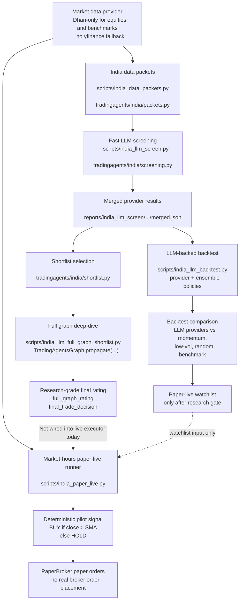

# India Signal Flow

This document maps how India-market signals are generated today, who generates them, and which paths are currently connected versus still separate.

## Why This Exists

The repo currently has two different India decision tracks:

1. A research path that creates `Buy / Overweight / Hold / Underweight / Sell` ratings using LLM screening and optionally `TradingAgentsGraph`.
2. A paper-live execution path that currently generates its own deterministic `BUY / HOLD` pilot signals during market hours.

That distinction matters because the paper-live runner is not yet executing the LLM research decisions directly. This document makes that boundary explicit so future integration work is easier to reason about and verify.

## End-to-End Map

## Stage Ownership

### 1. Data acquisition and packetization

- Entry point: [`/Users/nakulb/TradingAgents/scripts/india_data_packets.py`](/Users/nakulb/TradingAgents/scripts/india_data_packets.py)
- Core builder: [`/Users/nakulb/TradingAgents/tradingagents/india/packets.py`](/Users/nakulb/TradingAgents/tradingagents/india/packets.py)
- Responsibility:
  - Resolve instruments.
  - Pull OHLCV and benchmark data.
  - Record provider snapshots and data-quality metadata.
  - Build model-neutral packets for downstream research.

This stage does not create a trading rating. It creates the input payload that later stages consume.

Current India data policy:

- Equities use Dhan `NSE_EQ` / `BSE_EQ` candles.
- Nifty benchmarks use Dhan `IDX_I` index candles.
- yfinance is not used as an India fallback.
- Expanded NSE screening should pass `TRADINGAGENTS_INDIA_REGISTRY_CSV=data/india_nse_nifty50_registry.csv`.

### 2. Fast LLM screening

- Entry point: [`/Users/nakulb/TradingAgents/scripts/india_llm_screen.py`](/Users/nakulb/TradingAgents/scripts/india_llm_screen.py)
- Core logic: [`/Users/nakulb/TradingAgents/tradingagents/india/screening.py`](/Users/nakulb/TradingAgents/tradingagents/india/screening.py)
- Exact signal generator: `_screen_packet(...)`
- Mechanism:
  - Builds a compact JSON prompt from packet data.
  - Calls the configured LLM provider with `client.invoke(...)`.
  - Parses model output into one of:
    - `Buy`
    - `Overweight`
    - `Hold`
    - `Underweight`
    - `Sell`

This is the first place where the five-level rating is generated.

### 3. Shortlist selection

- Core logic: [`/Users/nakulb/TradingAgents/tradingagents/india/shortlist.py`](/Users/nakulb/TradingAgents/tradingagents/india/shortlist.py)
- Responsibility:
  - Group provider decisions by ticker and decision date.
  - Prioritize aggressive entry ratings (`Buy`, `Overweight`).
  - Escalate cases where providers materially disagree.

This stage does not generate a new rating. It decides which names deserve deeper review.

### 4. LLM-backed backtesting

- Entry point: [`/Users/nakulb/TradingAgents/scripts/india_llm_backtest.py`](/Users/nakulb/TradingAgents/scripts/india_llm_backtest.py)
- Signal adapter: [`/Users/nakulb/TradingAgents/tradingagents/india/llm_backtest.py`](/Users/nakulb/TradingAgents/tradingagents/india/llm_backtest.py)
- Responsibility:
  - Convert LLM screening decisions into simulator `Signal` objects.
  - Preserve provider, model, confidence, target horizon text, and numeric `horizon_sessions`.
  - Compare each provider independently.
  - Compare ensemble policies: consensus, confidence-weighted, and disagreement-filtered.

The default India research provider set is now:

- `anthropic`
- `google`
- `openai-gpt-5-4`
- `openrouter-deepseek-v4`

`openrouter-openai-4o-mini` is intentionally excluded from the default research set because direct OpenAI `gpt-5.4` is available for higher-quality comparison. OpenRouter remains in scope for DeepSeek.

### 5. Full graph deep-dive

- Entry point: [`/Users/nakulb/TradingAgents/scripts/india_llm_full_graph_shortlist.py`](/Users/nakulb/TradingAgents/scripts/india_llm_full_graph_shortlist.py)
- Decision engine: `TradingAgentsGraph.propagate(...)`
- Output:
  - `full_graph_rating`
  - `final_trade_decision`

This is the deepest research decision stage in the current India stack.

### 6. Paper-live market-hours execution

- Entry point: [`/Users/nakulb/TradingAgents/scripts/india_paper_live.py`](/Users/nakulb/TradingAgents/scripts/india_paper_live.py)
- Live signal generator:
  - `signal = "BUY" if close > sma else "HOLD"`
- Execution sink:
  - `PaperBroker.place_order(...)`

This path is intentionally simple and deterministic. It now supports a watchlist file via `--tickers-file`, but it does not yet consume ratings directly. It does not currently consume:

- LLM screening ratings
- shortlist outputs
- `full_graph_rating`
- `final_trade_decision`

## Current Architecture Truth

The current India system is **not** a single unified signal pipeline.

- Research path:
  - packets -> LLM screen -> shortlist -> full graph
- Paper-live path:
  - live Dhan/YFinance data -> SMA rule -> paper orders

That means the current paper-live run is better understood as a guarded execution harness for market-hours monitoring, not yet the final live expression of the India LLM research stack.

## Why It Was Built This Way

This split is defensible for the current roadmap:

- It reduces live-market operational risk while India auth, provider handling, and market-hours behavior are still being stabilized.
- It keeps research iteration fast without binding every LLM output directly to market-hours execution.
- It provides a deterministic baseline so LLM-driven performance can later be measured against a simpler control strategy.

## Tradeoffs

- Benefit:
  - Safer paper-live operations.
  - Easier debugging of provider/auth/runtime issues.
  - Cleaner separation between research and execution.

- Cost:
  - The paper-live runner does not reflect the strongest research output yet.
  - `Buy / Sell / Overweight / Underweight` ratings are not yet what places paper orders intraday.
  - Report consumers could incorrectly assume the live runner is already driven by `TradingAgentsGraph`.

## Recommended Next Integration Step

The cleanest next step is to add an explicit handoff artifact between research and paper-live, for example:

- `approved_signal_packet.json` per ticker/date/session, containing:
  - source provider(s)
  - packet config hash
  - `screen_rating`
  - `full_graph_rating`
  - confidence
  - target horizon
  - risk constraints
  - generated-at timestamp
  - expiry / staleness rules

Then the paper-live runner can consume only approved, traceable research outputs instead of recomputing a local SMA-only signal.

Before that handoff is promoted, run LLM-backed backtests and require any candidate rule to beat the simple momentum baseline. The current deterministic pilot underperformed momentum, so momentum is the minimum hurdle for treating LLM output as useful rather than just expensive.

## Decision Notes

- This document reflects the current repo state as of `2026-05-14`.
- It is a snapshot of architecture, not a promise that the current live runner is the final execution design.
- If this integration becomes the main India execution path, add a small ADR capturing:
  - whether paper-live should consume screen ratings directly or only full-graph outputs
  - whether LLM decisions are generated pre-open, post-close, or rolling intraday
  - how stale signals are invalidated before paper/live execution
